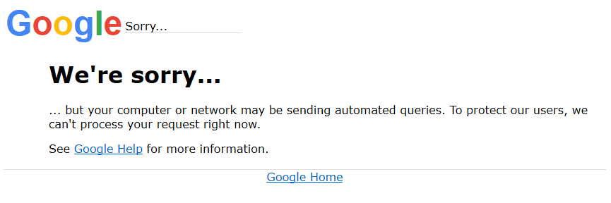

# Google Developer API 호출 시 html 에러

## Google Developer API 호출 시 html 형식의 "We're sorry..." 에러

Google Developer API 호출 시에 간헐적으로 html 형식의 에러를 반환하는 경우가 있다.
반환된 html 의 [Google Help](https://support.google.com/websearch/answer/86640)링크를 확인할 결과 아래와 같은 사유로 인하여 구글에서 차단을 한 것으로 추정된다.
* 컴퓨터 네트워크에서 비정상적인 트래픽 감지
	+ 네트워크에 있는 기기에서 Google에 자동화된 트래픽을 보내고 있는 것으로 보이면 'Google 시스템이 컴퓨터 네트워크에서 비정상적인 트래픽을 감지했습니다.'라는 메시지가 표시될 수도 있습니다.
	+ Google에서 자동화된 트래픽으로 간주하는 상황
		- 로봇, 컴퓨터 프로그램, 자동화된 서비스나 검색 스크래퍼에서 검색어를 전송하는 경우
		- 웹사이트나 웹페이지가 Google에 표시되는 순위를 확인하기 위해 소프트웨어로 Google에 검색어를 전송하는 경우
	+ 메시지가 표시될 때 해결책
		- 오류 페이지에는 대부분 구불구불한 보안문자(CAPTCHA)와 입력 상자가 표시됩니다. Google을 계속 사용하려면 구불구불한 문자를 입력 상자에 입력해야 합니다. 그러면 Google에서 로봇이 아닌 실제 사용자가 요청을 보내고 있음을 알 수 있습니다. 보안문자를 올바르게 입력하면 메시지가 사라지고 Google을 다시 사용할 수 있습니다.

## 해결
* Google developer API 를 호출 하는 서버의 Public IP 를 변경한다.
* Google developer API 를 호출 하는 서버가 NAT Gateway 로 되어있는 경우라면 Outbound IP 를 변경한다.
* 간헐적으로 구글에서 아무 이유없이 일시적으로 IP 를 차단하는 경우가 있으므로 시간이 경과된 후 다시 시도한다.