# Google Real-time notification Notification

## Document
Playstore 에서 발생한 이벤트를 전달받는 기능이다.
[https://developer.android.com/google/play/billing/realtime_developer_notifications?hl=ko](https://developer.android.com/google/play/billing/realtime_developer_notifications?hl=ko)

## Google Cloud Pub/Sub
Google Cloud 에서 제공하는 Pub/Sub 을 이용한 메시지 수신을 확인한다.
[https://cloud.google.com/pubsub/docs?hl=ko](https://cloud.google.com/pubsub/docs?hl=ko)

### 기본 개념
[안내 동영상](https://youtu.be/MjEam95VLiI)
* 토픽(주제): 게시자가 메세지를 전송하는 리소스
* 구독: 특정 토픽의 메세지가 구독 클라이언트로 전달되는 리소스
* 메세지: 게시자가 토픽에 전달하여 구독자에게 전달되는 데이터와 속성의 조합
* 메세지 속성: 게시자가 메세지에 대해 정의할 수 있는 K-V.

### Subscription
구독에 대한 내용을 정리한다.

#### 전송 횟수
메세지 저장소에 저장된 모든 메세지는 최소 1회 이상 전송된다. 단, 아래와 같은 경우에는 전송 대상에서 제외된다.
* 저장된지 7일이 지난 메세지는 메세지 저장소에서 자동 삭제되기에 전송이 불가능하다.
	+ 저장 기간은 게시자가 설정이 가능하다(10분 ~ 7일)
* 구독이 설정되기 전에 생성된 메세지는 받을 수 없다.

#### 구독 방법
게시자가 게시한 메세지를 구독하기 위한 방법은 아래와 같다.
* 가져오기 구독
* 내보내기 구독

##### 가져오기 구독
[https://cloud.google.com/pubsub/docs/pull?hl=ko](https://cloud.google.com/pubsub/docs/pull?hl=ko)

##### 내보내기 구독
[https://cloud.google.com/pubsub/docs/push?hl=ko](https://cloud.google.com/pubsub/docs/push?hl=ko)

## 설정
### Google Cloud Pub/Sub 설정
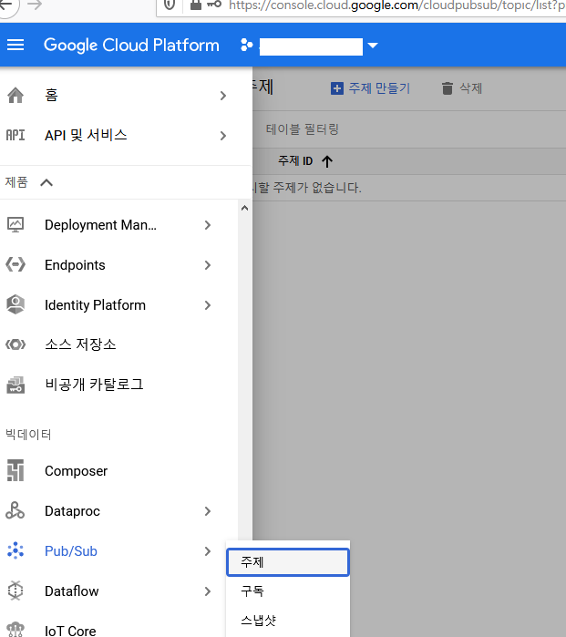
* Google Cloud Console 에 접속 후 빅데이터 > Pub/Sub 메뉴로 이동한다.
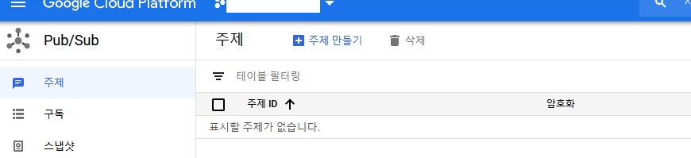
* 상단의 "주제 만들기"를 클릭하여 주제를 생성한다.
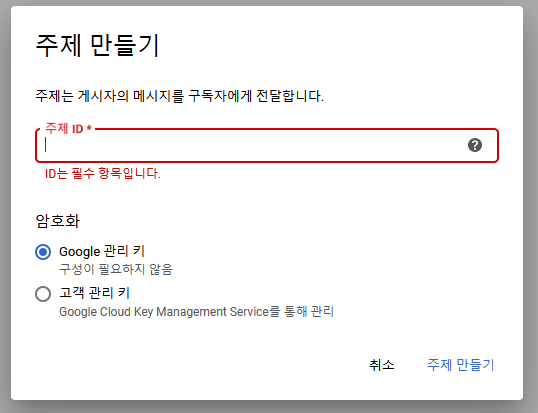
* 주제 ID 를 작성하여 하단의 "주제 만들기" 버튼을 클릭하여 생성한다.
	+ 주제는 각 게임별로 생성하며 주제 ID 의 규칙은 아래와 같다.
		- iap-{game-name}
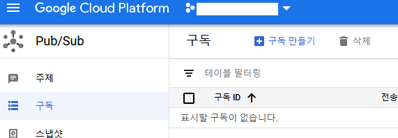
* 생성된 주제의 맨 우측의 "more" 버튼을 클릭하여 권한 보기를 선택한다.
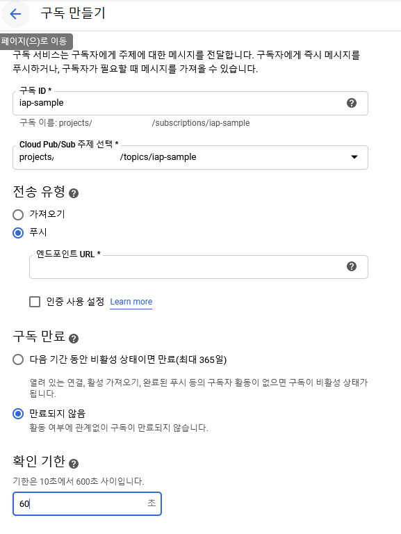
* "구성원 추가" 버튼을 클릭한다.
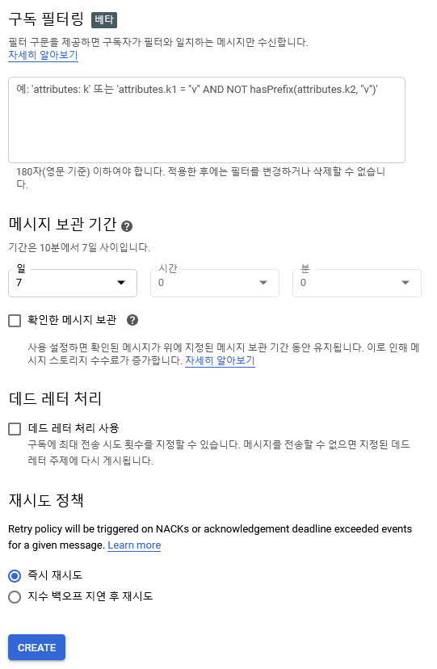
* 새 구성원에 "google-play-developer-notifications@system.gserviceaccount.com" 을 지정하고, 역할에는 "게시/구독 게시자" 를 선택하고 저장한다.
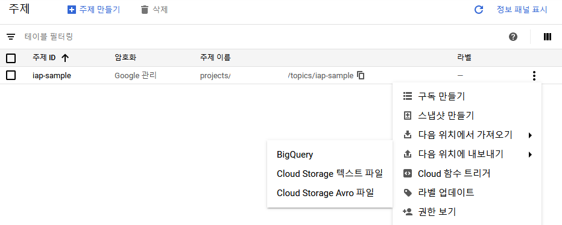
* 좌측의 "구독" 메뉴를 선택 후 "구독 만들기" 버튼을 클릭한다.
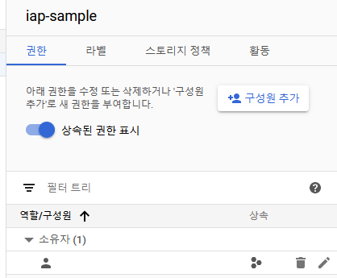
* 구독 ID 는 주제 ID 와 동일하게 설정한다.
* Cloud Pub/Sub 주제 선택
	+ 앞서 생성한 주제 ID 를 선택한다.
* 전송 유형 선택
	+ 푸시 선택하고 엔드포인트 URL 을 설정한다.
* 구독 만료 유형
	+ 만료되지 않음 선택
* 확인 기한
	+ 구독을 수신하고 수신 여부를 전달받는 시간으로 넉넉하게 60초로 설정한다.
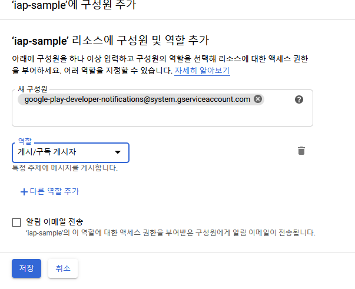
* 메시지 보관 기간
	+ 7일로 설정한다.
	+ 만약 해당 메세지를 수신하였다는 응답을 받지 못하면 7일 내에 다시금 전달된다.

### Play Console 설정
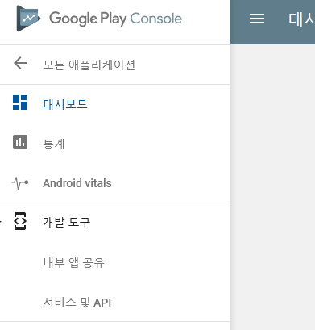
* Google Play Console 에 접속하고, 설정할 게임을 선택한 후 좌측의 개발 도구 > 서비스 및 API 메뉴를 선택한다.
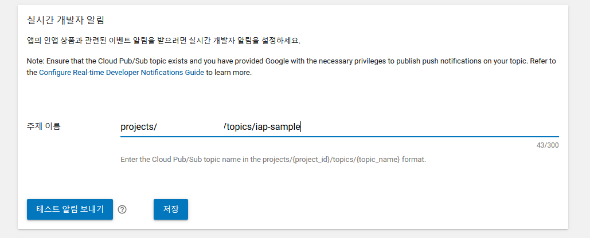
* 하단의 "실시간 개발자 알림" 항목에 앞서 생성한 주제 이름을 입력하여 저장한다.

## notification data
Real-time Notification 을 통해 전달받은 데이터는 아래와 같다.
```
{
	"message": {
		"attributes": {
			"key": "value"
		},
		"data": "eyAidmVyc2lvbiI6IHN0cmluZywgInBhY2thZ2VOYW1lIjogc3RyaW5nLCAiZXZlbnRUaW1lTWlsbGlzIjogbG9uZywgIm9uZVRpbWVQcm9kdWN0Tm90aWZpY2F0aW9uIjogT25lVGltZVByb2R1Y3ROb3RpZmljYXRpb24sICJzdWJzY3JpcHRpb25Ob3RpZmljYXRpb24iOiBTdWJzY3JpcHRpb25Ob3RpZmljYXRpb24sICJ0ZXN0Tm90aWZpY2F0aW9uIjogVGVzdE5vdGlmaWNhdGlvbiB9",
		"messageId": "136969346945"
	},
	"subscription": "projects/myproject/subscriptions/mysubscription"
}
```
* subscription: 구독 아이디
* message.attributes: 메세지의 속성들의 집합
* message.data: Base64 로 인코딩된 메세지 내용
* message.messageId: 메세지 아이디

Base64 로 인코딩된 message.data 를 디코딩하면 아래와 같이 구매한 상품 정보를 확인할 수 있다.

### One Time Product Notification
1회성 상품을 구매하였을 경우의 유형
```
{
	"version": "1.0",
	"packageName": "com.test.sample",
	"eventTimeMillis": 1595403693695,
	"oneTimeProductNotification": {
		"version": "1.0",
		"notificationType": 1,
		"purchaseToken": ".,..",
		"sku": "test_1"
	}
}
```
* version: 메세지의 버전
* packageName: 패키지 명
* eventTimeMillis: 이벤트가 발생한 시간
* oneTimeProductNotification.version: notification 의 버전
* oneTimeProductNotification.notificationType: notification 의 유형
	- 1: 지연 결제 상품을 성공적으로 구매함
	- 2: 지연 결제 상품을 취소함
* oneTimeProductNotification.purchaseToken: 구매 토큰(영수증)
* oneTimeProductNotification.sku: 상품 아이디

#### 실제 전달된 데이터
데이터가 전달되지 않음

### Subscription Notification
구독형 상품을 구매하였을 경우의 유형
```
{
	"version": "1.0",
	"packageName": "com.test.sample",
	"eventTimeMillis": 1595403693695,
	"subscriptionNotification": {
		"version": "1.0",
		"notificationType": 1,
		"purchaseToken": ".,..",
		"subscriptionId": "test_2"
	}
}
```
* version: 메세지의 버전
* packageName: 패키지 명
* eventTimeMillis: 이벤트가 발생한 시간
* subscriptionNotification.version: notification 의 버전
* subscriptionNotification.notificationType: notification 의 유형
	- 1: 결제 보류 상태에서 구독이 복구됨
	- 2: 구독이 갱신됨
	- 3: 구독이 취소됨
	- 4: 새로운 구독이 시작됨
	- 5: 결제 보류 상태
	- 6: 구독 유예 기간이 시작됨
	- 7: 사용자가 play store > 계정 > 구독 메뉴에서 구독을 활성화함
	- 8: 사용자가 구독 상품의 가격 변동을 확인함
	- 9: 구독 갱신 기한이 연장됨
	- 10: 구독이 일시 중지됨
	- 11: 구독 일시 중지 기간이 변경됨
	- 12: 구독 만료 전에 사용자에 의해 취소됨
	- 13: 구독이 만료됨
* subscriptionNotification.purchaseToken: 구매 토큰(영수증)
* subscriptionNotification.subscriptionId: 상품 아이디

#### 실제 전달된 데이터
```
Google Real-time Notification ===> data: eyJ2ZXJzaW9uIjoiMS4wIiwicGFja2FnZU5mVyc2lvbiI6IjEuMCIsIm5vdGlmaWNhdGlvblR5cGUiOjQsInB1cmNoYXNlVG9rZW4iOiJmbm9nYnBpZWRrZWJhamZlYW9sbWpubWQuQU8tSjFPd1ZfOTFqczJBVDVZWmYyblA3djl1NFpwYUxZYXNLbnpVSEluMnVWUVJVWG1uamJjSDBfazI1RXJMcHQxTjdaa2Q4bUlGRzJUNjZkNnJZSFB4Wjl2X1dEdnBFbzhnNldoY2RISC1Od3lmel9tNVRuMHM4YV9Ec3RIeWNjLThUZ3lOZWpwN3kiLCJzdWJzY3JpcHRpb25JZCI6ImpveXBsZV9zdWJfdGVzdF8yIn19, messageId: 1367885263800285
Google Real-time Notification ===> convert data: {"version":"1.0","packageName":"com.test.sample","eventTimeMillis":"1595481526062","subscriptionNotification":{"version":"1.0","notificationType":4,"purchaseToken":PURCHASE_TOKEN,"subscriptionId":"test_2"}}
```

### Test Notification
테스트 알림 발송 시 전달되는 유형
```
{
	"version": "1.0",
	"packageName": "com.test.sample",
	"eventTimeMillis": 1595403693695,
	"testNotification": {
		"version": "1.0"
	}
}
```
* version: 메세지의 버전
* packageName: 패키지 명
* eventTimeMillis: 이벤트가 발생한 시간
* testNotification.version: notification 의 버전

#### 실제 전달된 데이터
```
Google Real-time Notification ===> data: eyJ2ZXJzaW9uIjoiMS4wIiwicGFja2FnZU5mVyc2lvbiI6IjEuMCIsIm5vdGlmaWNhdGlvblR5cGUiOjQsInB1cmNoYXNlVG9rZW4iOiJmbm9nYnBpZWRrZWJhamZlYW9sbWpubWQuQU8tSjFPd1ZfOTFqczJBVDVZWmYyblA3djl1NFpwYUxZYXNLbnpVSEluMnVWUVJVWG1uamJjSDBfazI1RXJMcHQxTjdaa2Q4bUlGRzJUNjZkNnJZSFB4Wjl2X1dEdnBFbzhnNldoY2RISC1Od3lmel9tNVRuMHM4YV9Ec3RIeWNjLThUZ3lOZWpwN3kiLCJzdWJzY3JpcHRpb25JZCI6ImpveXBsZV9zdWJfdGVzdF8yIn19, messageId: 1367885263800285
Google Real-time Notification ===> convert data: {"version":"1.0","packageName":"com.test.sample","eventTimeMillis":"1595481526062","subscriptionNotification":{"version":"1.0"}}
```

## 고려사항
구독 상품의 경우 결제 혹은 구독 갱신이 이루어지는 시점과 Pub/Sub 을 통해 notification 을 전달받는 시간이 비슷하며, 거의 동시에 동작한다고 볼 수 있다.  
단, 일반 상품 구매 시 전달되는 One Time Product Notification 은 모든 일반 상품(consumable) 이 아닌 지연 결제 상품만 전달이 된는 것으로 보인다.(일반 상품 구매 시 전달이 되지 않는 것을 확인)  
아래는 지연 결제 상품만 지원한다는 내용의 공식 가이드 문서이다.  
[https://developer.android.com/google/play/billing/billing_library_releases_notes?hl=ko#2_0_pending](https://developer.android.com/google/play/billing/billing_library_releases_notes?hl=ko#2_0_pending)
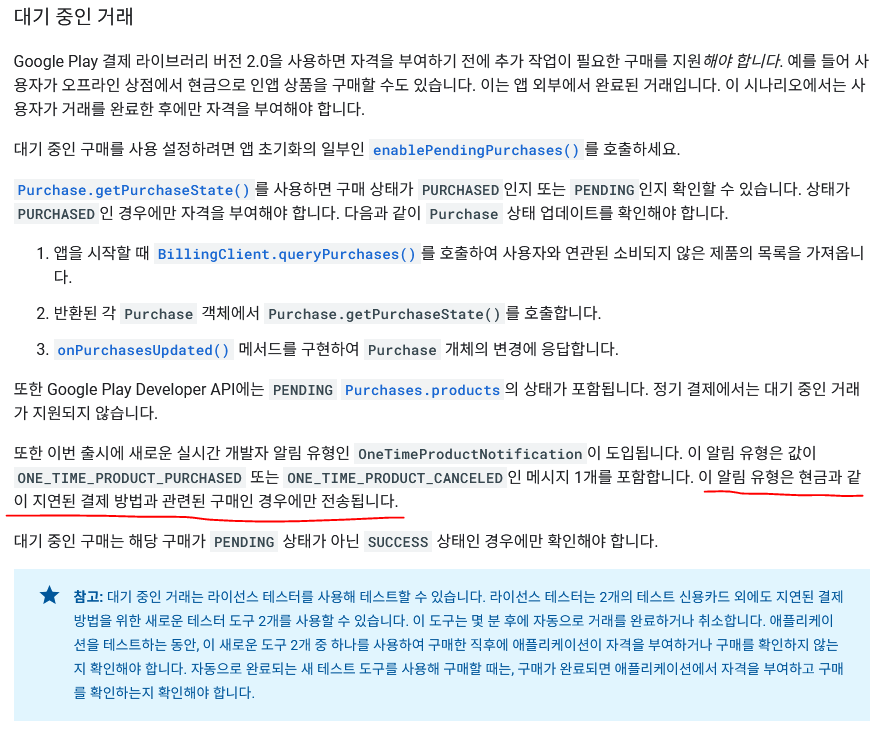

## 적용 방향
Real-time Notification 을 이용한 구매 프로세스 적용 방법은 아래와 같다.
* 구독 갱신 중 결제 오류로 인하여 본래 갱신 일자 보다 나중에 갱신되는 경우
	- subscriptionNotification.notificationType 이 1(결제 보류 상태에서 구독이 복구됨)인 경우를 확인하여 구독 갱신 프로세스를 진행한다.
* 지연 결제 상품의 경우
	- oneTimeProductNotification.notificationType 이 1(지연 결제 상품을 성공적으로 구매함)인 경우를 확인하여 구매 프로세스를 진행한다.