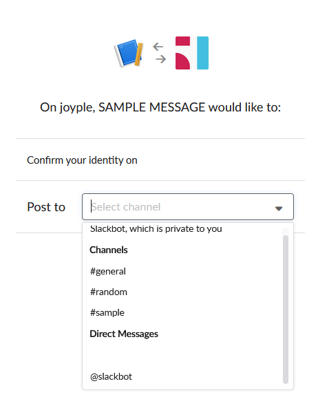

# Slack

## Incomming Webhoos
[참고문서](https://api.slack.com/messaging/sending)

### 앱 만들기
슬랙 개발자 사이트에서 새로운 앱을 등록한다.
이후, 아래와 같이 설정한다.

#### 앱 생성

#### Features > Incomming Webhooks

#### Add New Webhook to Workspace

메세지를 보낼 채널 혹은 사용자를 선택한다.

### 샘플 앱 만들기
해당 기능을 테스트하기 위해 아래와 같은 샘플 앱을 만든다.

#### 샘플 앱

### 기능 테스트
샘플 앱을 통하여 채널 혹은 사용자에게 메세지를 전송한다.

#### 메세지 전송

#### 전송 결과

### 결과
해당 API 는 텍스트로만 보낼 수 있으며, 특정 채널이나 사용자에게만 전송이 가능하다.

## Sending message
[참고문서](https://api.slack.com/messaging/sending)

### 앱 설정하기
앱의 권한 설정에서 필요한 권한을 설정한다.

#### Features > OAuth & Permissions

* Permission Scopes
	+ channels:read: 채널에 접근하기 위한 권한
	+ chat:write:bot: 메세지를 전송하기 위한 권한(채널 혹은 bot 에만 전송 가능)
	+ chat:write:user: 메세지를 전송하기 위한 권한(사용자에게 직접 전송 가능)

#### Access Token 얻기

### 샘플 앱 만들기
해당 기능을 테스트하기 위해 아래와 같은 샘플 앱을 만든다.

#### 샘플 앱

#### 연동 API
chat.postMessage API
[참고문서](https://api.slack.com/methods/chat.postMessage)

### 기능 테스트
샘플 앱을 통하여 채널 혹은 사용자에게 메세지를 전송한다.

#### 전송 결과

### 결과
메세지를 수신 받는 것까지 확인하였고, 버튼을 통한 RestAPI 호출 가능성까지 확인하였다.
여러 사람에게 메세지를 보내는 것도 가능하다. 단, 보내는 사람의 목록에 대해서는 [channels.info API](https://api.slack.com/methods/channels.info) 를 통하여 특정 채널의 사용자를 가져와서 전송하는 편이 좋다.

## Interactive Components
Interactive component 설정을 통한 사용자의 액션(수신된 메세지의 버튼 클릭 등)을 webhook 으로 받아서 처리할 수 있도록 하는 기능

### 앱 설정하기
앱의 권한 설정에서 필요한 권한을 설정한다.

#### Features > Interactive Components

* Interactivity
	+ Request URL: Interactive Components 를 통한 액션을 전달 받을 endpoint

#### Webhook Response
POST method 를 통한 Request body 에 Json 형식으로 값을 전달 받는다.

#### Webhook 처리 후 결과
Webhook 으로 전달 받아 처리한 후 다시 Slack 으로 결과를 전달하여 메세지의 상태를 변경한다.

* 메세지를 수신하였을 때

* 메세지를 수신하여 이벤트를 처리하였을 때

### 결과
메세지를 수신 받는 것까지 확인하였고, 버튼을 통한 이벤트 처리까지 확인하였다.
여러 사람에게 메세지를 보내는 것도 가능하다. 단, 보내는 사람의 목록에 대해서는 [channels.info API](https://api.slack.com/methods/channels.info) 를 통하여 특정 채널의 사용자를 가져와서 전송하는 편이 좋다.