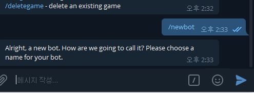
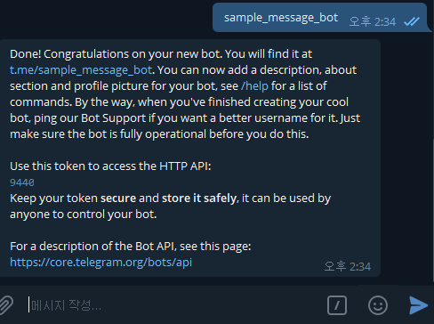
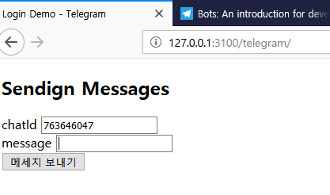
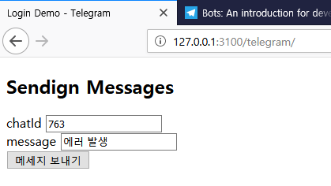
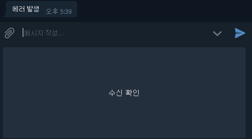
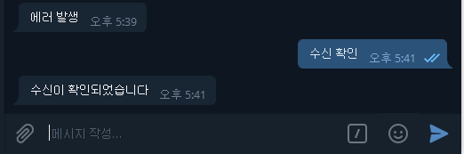

# Telegram

## Bot API
[참고문서](https://core.telegram.org/bots)

### 봇 만들기
텔레그램 봇을 만들기 위해서 텔레그램 [botFarther](https://telegram.me/botfather) 사이트로 이동한다.
이후, 아래와 같이 설정한다.

#### 봇 생성
  
채팅창에 /newbot 을 입력한다.

  
봇의 이름을 설정한다. 마지막 suffix 는 _bot 으로 끝남에 주의하고, "Use this token...." 으로 시작하는 부분의 accessToken 을 적어둔다.
해당 accessToken 을 이용하여 아래의 API 를 호출하여 봇이 생성되었는지 확인한다.
##### Request URL
```
https://api.telegram.org/bot<ACCESS_TOKEN>/getMe
```
##### Response
```
{
    "ok": true,
    "result": {
        "id": 944099847,
        "is_bot": true,
        "first_name": "SAMPLE_MESSAGE",
        "username": "sample_message_bot"
    }
}
```

### Webhook 설정
#### Webhook URL 설정
```
https://api.telegram.org/bot<ACCESS_TOKEN>/setWebhook?url=<END_POINT>
```
#### Webhook 설정 확인
```
https://api.telegram.org/bot<ACCESS_TOKEN>/getWebhookInfo
```

### 샘플 앱 만들기
해당 기능을 테스트하기 위해 아래와 같은 샘플 앱을 만든다.

#### 샘플 앱


### 기능 테스트
샘플 앱을 통하여 채널 혹은 사용자에게 메세지를 전송한다.

#### 메세지 전송


#### 메세지를 수신하였을 때
  
에러가 발생되었다는 메세지와 함께 수신 확인 버튼이 표시된다.

#### 메세지를 수신하여 이벤트를 처리하였을 때
  
수신 확인 버튼이 사라지면서 확인 메세지가 수신된다.

### 결과
메세지를 수신 받는 것까지 확인하였고, 버튼을 통한 이벤트 처리까지 확인하였다.
여러 사람에게 메세지를 보내는 것도 가능하다. 단, 메세지를 전송할 수 있도록 사용자를 등록하는 과정이 필요하다.