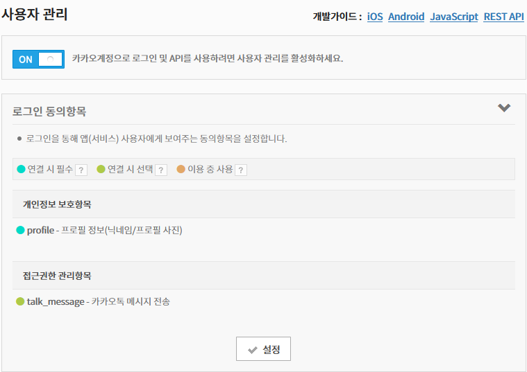
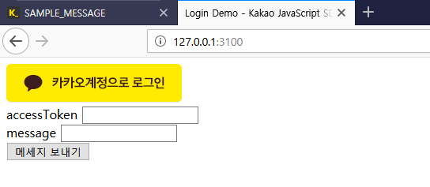
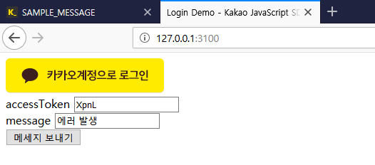
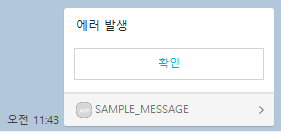

# Kakaotalk

## 나에게 보내기 API
카카오 계정으로 가입된 사용자 본인에게 메세지를 전송하는 기능  
[참고문서](https://developers.kakao.com/docs/restapi/kakaotalk-api#%EB%82%98%EC%97%90%EA%B2%8C-%EB%B3%B4%EB%82%B4%EA%B8%B0)

### 앱 만들기
카카오 개발자 사이트에서 새로운 애플리케이션을 등록한다.  
이후, 아래와 같이 설정한다.

#### 설정 > 사용자 관리

* 로그인 동의항목
	+ profile: 기본 권한
	+ talk_message: 메세지를 전송하기 위한 권한. 해당 권한을 획득하지 못하면 메세지를 전송할 수 없다.

### 샘플 앱 만들기
해당 기능을 테스트하기 위해 아래와 같은 샘플 앱을 만든다.

#### 샘플 앱

### 기능 테스트
샘플 앱을 통하여 메세지 전송에 필요한 accessToken 을 얻어 메세지를 전송한다.

#### 메세지 전송

#### 전송 결과

### 결과
메세지를 수신 받는 것까지 확인하였고, 버튼을 통한 RestAPI 호출 가능성까지 확인하였다.  
단, 나에게 보내기 기능은 사용자 본인에게 보내는 기능이라 **알림을 받을 수 없고, 카카오톡을 직접 실행해서 확인해야하는 단점이 있다.**

## 메세지 전송 API
카카오 계정으로 가입된 사용자들에게 메세지를 전송할 수 있는 기능  
[참고문서](https://developers.kakao.com/docs/restapi/kakaotalk-api#%EB%A9%94%EC%8B%9C%EC%A7%80-%EC%A0%84%EC%86%A1)

### 앱 검수받기
메세지 전송 기능을 사용하기 위해서는 앱을 검수받아야 한다.  
[참고문서](https://devtalk.kakao.com/t/api/80421)

### 결과
앱 검수에 필요한 사업자 등록증, 스토리 보드 등이 준비되지 않아 검수를 신청하지 못하였다.  
API 문서를 보았을 때 나에게 보내기 기능과 같은 결과를 받을 수 있을거라 보인다.